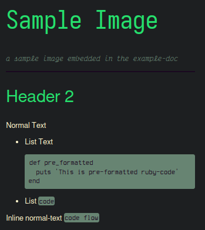

# Marker  
_Create quick-notes which comply with css-based branding standards_  

---  

## Dependencies:  
  - ruby installed  
  - __Gems:__  
    - commonmarker  
    - github-markup  

__Install Missing Gems:__  
 - run `bundle` from the root 'marker' folder  

### Usage:  
1. Copy *.md files to this directory (or copy 'marker.rb' and 'lib' folder to *.md files)  
2. `ruby marker.rb <file_name>.md`  
3. `chrome <file_name>.html`  
4. `File` > `Print` > 'Save as PDF'  

#### OR:  
1. `ruby marker.rb`  
    - marker can find all local *.md files and build html for them  
